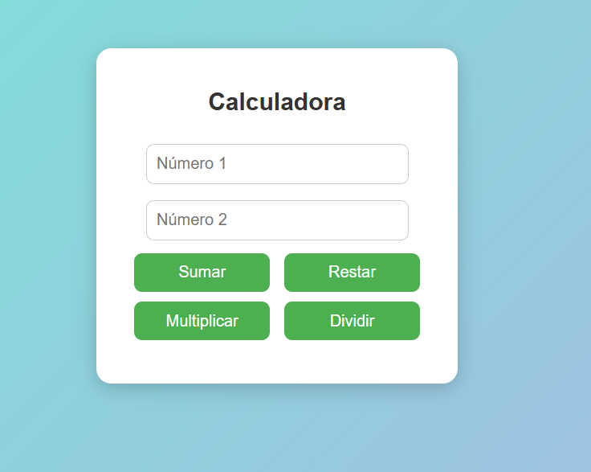

# Ejercicio: Calculadora básica con eventos

## Enunciado
Crea una aplicación (puede ser en **JavaScript** con HTML y css opcional) que:

1. Tenga **dos campos de texto** para ingresar números.  
2. Cuatro botones: **Sumar**, **Restar**, **Multiplicar**, **Dividir**.  
3. Cada botón debe **ejecutar una operación diferente** cuando el usuario haga clic.  
4. El resultado debe mostrarse en pantalla inmediatamente después del evento (**clic**).  
5. Debe manejar errores como:  
   - **Campos vacíos**.  
   - **División por cero**.

```   
<!DOCTYPE html>
<html lang="es">
<head>
    <meta charset="UTF-8">
    <title>Calculadora POE</title>
    <style>
        body {
            font-family: Arial, sans-serif;
            background: linear-gradient(135deg, #74ebd5, #ACB6E5);
            display: flex;
            justify-content: center;
            align-items: center;
            height: 100vh;
            margin: 0;
        }

        .calculadora {
            background: white;
            padding: 20px 30px;
            border-radius: 15px;
            box-shadow: 0 5px 20px rgba(0, 0, 0, 0.2);
            text-align: center;
            width: 300px;
        }

        h2 {
            color: #333;
            margin-bottom: 20px;
        }

        input {
            width: 80%;
            padding: 10px;
            margin: 8px 0;
            border-radius: 8px;
            border: 1px solid #ccc;
            font-size: 16px;
        }

        button {
            width: 45%;
            padding: 10px;
            margin: 5px;
            border: none;
            border-radius: 8px;
            background: #4CAF50;
            color: white;
            font-size: 16px;
            cursor: pointer;
            transition: background 0.3s ease;
        }

        button:hover {
            background: #45a049;
        }

        #resultado {
            margin-top: 15px;
            font-size: 18px;
            font-weight: bold;
            color: #444;
        }
    </style>
</head>
<body>
    <div class="calculadora">
        <h2>Calculadora </h2>
        <input type="number" id="num1" placeholder="Número 1">
        <input type="number" id="num2" placeholder="Número 2">
        <br>
        <button onclick="operar('sumar')">Sumar</button>
        <button onclick="operar('restar')">Restar</button>
        <button onclick="operar('multiplicar')">Multiplicar</button>
        <button onclick="operar('dividir')">Dividir</button>
        <p id="resultado"></p>
    </div>

    <script>
        function operar(accion) {
            const n1 = parseFloat(document.getElementById("num1").value);
            const n2 = parseFloat(document.getElementById("num2").value);
            const salida = document.getElementById("resultado");

            if (isNaN(n1) || isNaN(n2)) {
                salida.textContent = "⚠️ Por favor ingresa ambos números.";
                salida.style.color = "red";
                return;
            }

            let resultado;
            switch (accion) {
                case 'sumar':
                    resultado = n1 + n2;
                    break;
                case 'restar':
                    resultado = n1 - n2;
                    break;
                case 'multiplicar':
                    resultado = n1 * n2;
                    break;
                case 'dividir':
                    if (n2 === 0) {
                        salida.textContent = "❌ Error: División por cero.";
                        salida.style.color = "red";
                        return;
                    }
                    resultado = n1 / n2;
                    break;
            }

            salida.textContent = "✅ Resultado: " + resultado;
            salida.style.color = "green";
        }
    </script>
</body>
</html>

```

